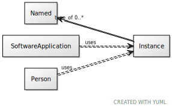

# Class: Instance

URI: [dcat:Instance](http://www.w3.org/ns/dcat#Instance)

## Mixin for

 * [Person](Person.md) (mixin) 
 * [SoftwareApplication](SoftwareApplication.md) (mixin) 

## Referenced by Class

## Attributes

### Own

 * [type_of](type_of.md)  0..\*
     * Range: [Named](Named.md)
