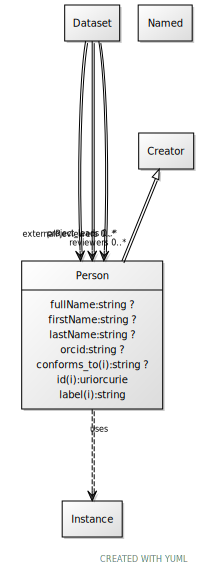

# Class: Person

URI: [dcat:Person](http://www.w3.org/ns/dcat#Person)

## Parents

 *  is_a: [Creator](Creator.md)

## Uses Mixin

 *  mixin: [Instance](Instance.md)

## Referenced by Class

 *  **None** *[externalReviewers](externalReviewers.md)*  0..\*  **[Person](Person.md)**
 *  **None** *[project_leads](project_leads.md)*  0..\*  **[Person](Person.md)**
 *  **None** *[reviewers](reviewers.md)*  0..\*  **[Person](Person.md)**

## Attributes

### Own

 * [fullName](fullName.md)  0..1
     * Range: [String](types/String.md)
 * [firstName](firstName.md)  0..1
     * Range: [String](types/String.md)
 * [lastName](lastName.md)  0..1
     * Range: [String](types/String.md)
 * [orcid](orcid.md)  0..1
     * Range: [String](types/String.md)

### Inherited from Creator:

 * [conforms_to](conforms_to.md)  0..1
     * Range: [String](types/String.md)

### Mixed in from Instance:

 * [type_of](type_of.md)  0..\*
     * Range: [Named](Named.md)

## Other properties

|  |  |  |
| --- | --- | --- |
| **Mappings:** | | schema:Person |