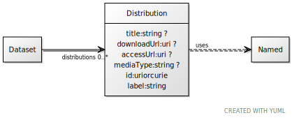

# Class: Distribution

URI: [ccf:Distribution](http://purl.org/ccf/Distribution)

## Uses Mixin

 *  mixin: [Named](Named.md)

## Referenced by Class

 *  **None** *[distributions](distributions.md)*  0..\*  **[Distribution](Distribution.md)**

## Attributes

### Own

 * [title](title.md)  0..1
     * Range: [String](types/String.md)
 * [downloadUrl](downloadUrl.md)  0..1
     * Range: [Uri](types/Uri.md)
 * [accessUrl](accessUrl.md)  0..1
     * Range: [Uri](types/Uri.md)
 * [mediaType](mediaType.md)  0..1
     * Range: [String](types/String.md)

### Mixed in from Named:

 * [id](id.md)  1..1
     * Range: [Uriorcurie](types/Uriorcurie.md)

### Mixed in from Named:

 * [label](label.md)  1..1
     * Range: [String](types/String.md)

## Other properties

|  |  |  |
| --- | --- | --- |
| **Mappings:** | | dcat:Distribution |