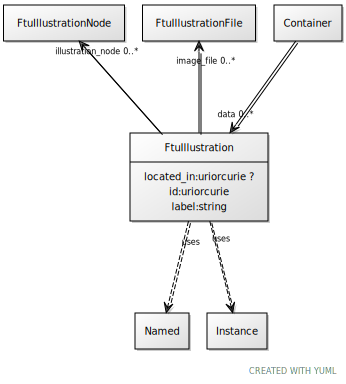

# Class: FtuIllustration

URI: [ccf:FtuIllustration](http://purl.org/ccf/FtuIllustration)

## Uses Mixin

 *  mixin: [Named](Named.md)
 *  mixin: [Instance](Instance.md)

## Referenced by Class

 *  **None** *[➞data](container__data.md)*  0..\*  **[FtuIllustration](FtuIllustration.md)**

## Attributes

### Own

 * [FtuIllustration➞located_in](FtuIllustration_located_in.md)  0..1
     * Range: [Uriorcurie](types/Uriorcurie.md)
 * [image_file](image_file.md)  0..\*
     * Range: [FtuIllustrationFile](FtuIllustrationFile.md)
 * [illustration_node](illustration_node.md)  0..\*
     * Range: [FtuIllustrationNode](FtuIllustrationNode.md)

### Mixed in from Named:

 * [id](id.md)  1..1
     * Range: [Uriorcurie](types/Uriorcurie.md)

### Mixed in from Named:

 * [label](label.md)  1..1
     * Range: [String](types/String.md)

### Mixed in from Instance:

 * [type_of](type_of.md)  0..\*
     * Range: [Named](Named.md)

## Other properties

|  |  |  |
| --- | --- | --- |
| **Mappings:** | | ccf:FtuIllustration |