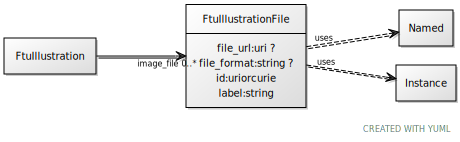

# Class: FtuIllustrationFile

URI: [ccf:FtuIllustrationFile](http://purl.org/ccf/FtuIllustrationFile)

## Uses Mixin

 *  mixin: [Named](Named.md)
 *  mixin: [Instance](Instance.md)

## Referenced by Class

 *  **None** *[image_file](image_file.md)*  0..\*  **[FtuIllustrationFile](FtuIllustrationFile.md)**

## Attributes

### Own

 * [file_url](file_url.md)  0..1
     * Range: [Uri](types/Uri.md)
 * [file_format](file_format.md)  0..1
     * Range: [String](types/String.md)

### Mixed in from Named:

 * [id](id.md)  1..1
     * Range: [Uriorcurie](types/Uriorcurie.md)

### Mixed in from Named:

 * [label](label.md)  1..1
     * Range: [String](types/String.md)

### Mixed in from Instance:

 * [type_of](type_of.md)  0..\*
     * Range: [Named](Named.md)

## Other properties

|  |  |  |
| --- | --- | --- |
| **Mappings:** | | ccf:ImageFile |