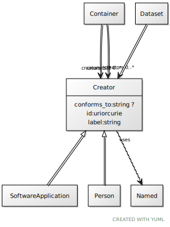

# Class: Creator

URI: [dcat:Creator](http://www.w3.org/ns/dcat#Creator)

## Uses Mixin

 *  mixin: [Named](Named.md)

## Children

 * [Person](Person.md)
 * [SoftwareApplication](SoftwareApplication.md)

## Referenced by Class

 *  **[Container](Container.md)** *[Container➞creators](Container_creators.md)*  1..\*  **[Creator](Creator.md)**
 *  **None** *[creators](creators.md)*  0..\*  **[Creator](Creator.md)**

## Attributes

### Own

 * [conforms_to](conforms_to.md)  0..1
     * Range: [String](types/String.md)

### Mixed in from Named:

 * [id](id.md)  1..1
     * Range: [Uriorcurie](types/Uriorcurie.md)

### Mixed in from Named:

 * [label](label.md)  1..1
     * Range: [String](types/String.md)
