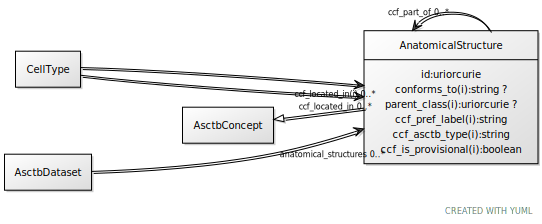

# Class: AnatomicalStructure

URI: [ccf:AnatomicalStructure](http://purl.org/ccf/AnatomicalStructure)

## Parents

 *  is_a: [AsctbConcept](AsctbConcept.md)

## Referenced by Class

 *  **[AnatomicalStructure](AnatomicalStructure.md)** *[AnatomicalStructure➞ccf_part_of](AnatomicalStructure_ccf_part_of.md)*  0..\*  **[AnatomicalStructure](AnatomicalStructure.md)**
 *  **[CellType](CellType.md)** *[CellType➞ccf_located_in](CellType_ccf_located_in.md)*  0..\*  **[AnatomicalStructure](AnatomicalStructure.md)**
 *  **None** *[anatomical_structures](anatomical_structures.md)*  0..\*  **[AnatomicalStructure](AnatomicalStructure.md)**
 *  **None** *[ccf_located_in](ccf_located_in.md)*  0..\*  **[AnatomicalStructure](AnatomicalStructure.md)**
 *  **None** *[ccf_part_of](ccf_part_of.md)*  0..\*  **[AnatomicalStructure](AnatomicalStructure.md)**

## Attributes

### Own

 * [AnatomicalStructure➞ccf_part_of](AnatomicalStructure_ccf_part_of.md)  0..\*
     * Range: [AnatomicalStructure](AnatomicalStructure.md)
 * [AnatomicalStructure➞id](AnatomicalStructure_id.md)  1..1
     * Range: [Uriorcurie](types/Uriorcurie.md)

### Inherited from AsctbConcept:

 * [conforms_to](conforms_to.md)  0..1
     * Range: [String](types/String.md)
 * [parent_class](parent_class.md)  0..1
     * Range: [Uriorcurie](types/Uriorcurie.md)
 * [AsctbConcept➞ccf_pref_label](AsctbConcept_ccf_pref_label.md)  1..1
     * Range: [String](types/String.md)
 * [AsctbConcept➞ccf_asctb_type](AsctbConcept_ccf_asctb_type.md)  1..1
     * Range: [String](types/String.md)
 * [AsctbConcept➞ccf_is_provisional](AsctbConcept_ccf_is_provisional.md)  1..1
     * Range: [Boolean](types/Boolean.md)
