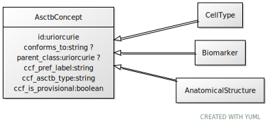

# Class: AsctbConcept

URI: [ccf:AsctbConcept](http://purl.org/ccf/AsctbConcept)

## Children

 * [AnatomicalStructure](AnatomicalStructure.md)
 * [Biomarker](Biomarker.md)
 * [CellType](CellType.md)

## Referenced by Class

## Attributes

### Own

 * [id](id.md)  1..1
     * Range: [Uriorcurie](types/Uriorcurie.md)
 * [conforms_to](conforms_to.md)  0..1
     * Range: [String](types/String.md)
 * [parent_class](parent_class.md)  0..1
     * Range: [Uriorcurie](types/Uriorcurie.md)
 * [AsctbConcept➞ccf_pref_label](AsctbConcept_ccf_pref_label.md)  1..1
     * Range: [String](types/String.md)
 * [AsctbConcept➞ccf_asctb_type](AsctbConcept_ccf_asctb_type.md)  1..1
     * Range: [String](types/String.md)
 * [AsctbConcept➞ccf_is_provisional](AsctbConcept_ccf_is_provisional.md)  1..1
     * Range: [Boolean](types/Boolean.md)
