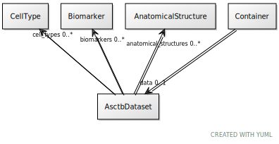

# Class: AsctbDataset

URI: [ccf:AsctbDataset](http://purl.org/ccf/AsctbDataset)

## Referenced by Class

 *  **None** *[➞data](container__data.md)*  0..1  **[AsctbDataset](AsctbDataset.md)**

## Attributes

### Own

 * [anatomical_structures](anatomical_structures.md)  0..\*
     * Range: [AnatomicalStructure](AnatomicalStructure.md)
 * [cell_types](cell_types.md)  0..\*
     * Range: [CellType](CellType.md)
 * [biomarkers](biomarkers.md)  0..\*
     * Range: [Biomarker](Biomarker.md)
