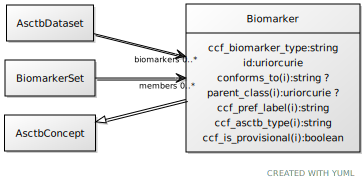

# Class: Biomarker

URI: [ccf:Biomarker](http://purl.org/ccf/Biomarker)

## Parents

 *  is_a: [AsctbConcept](AsctbConcept.md)

## Referenced by Class

 *  **None** *[biomarkers](biomarkers.md)*  0..\*  **[Biomarker](Biomarker.md)**
 *  **None** *[members](members.md)*  0..\*  **[Biomarker](Biomarker.md)**

## Attributes

### Own

 * [Biomarker➞ccf_biomarker_type](Biomarker_ccf_biomarker_type.md)  1..1
     * Range: [String](types/String.md)
 * [Biomarker➞id](Biomarker_id.md)  1..1
     * Range: [Uriorcurie](types/Uriorcurie.md)

### Inherited from AsctbConcept:

 * [conforms_to](conforms_to.md)  0..1
     * Range: [String](types/String.md)
 * [parent_class](parent_class.md)  0..1
     * Range: [Uriorcurie](types/Uriorcurie.md)
 * [AsctbConcept➞ccf_pref_label](AsctbConcept_ccf_pref_label.md)  1..1
     * Range: [String](types/String.md)
 * [AsctbConcept➞ccf_asctb_type](AsctbConcept_ccf_asctb_type.md)  1..1
     * Range: [String](types/String.md)
 * [AsctbConcept➞ccf_is_provisional](AsctbConcept_ccf_is_provisional.md)  1..1
     * Range: [Boolean](types/Boolean.md)
