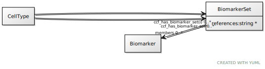

# Class: BiomarkerSet

URI: [ccf:BiomarkerSet](http://purl.org/ccf/BiomarkerSet)

## Referenced by Class

 *  **[CellType](CellType.md)** *[CellType➞ccf_has_biomarker_set](CellType_ccf_has_biomarker_set.md)*  0..\*  **[BiomarkerSet](BiomarkerSet.md)**
 *  **None** *[ccf_has_biomarker_set](ccf_has_biomarker_set.md)*  0..\*  **[BiomarkerSet](BiomarkerSet.md)**

## Attributes

### Own

 * [members](members.md)  0..\*
     * Range: [Biomarker](Biomarker.md)
 * [BiomarkerSet➞references](BiomarkerSet_references.md)  0..\*
     * Range: [String](types/String.md)
