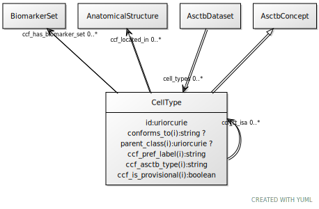

# Class: CellType

URI: [ccf:CellType](http://purl.org/ccf/CellType)

## Parents

 *  is_a: [AsctbConcept](AsctbConcept.md)

## Referenced by Class

 *  **[CellType](CellType.md)** *[CellType➞ccf_ct_isa](CellType_ccf_ct_isa.md)*  0..\*  **[CellType](CellType.md)**
 *  **None** *[ccf_ct_isa](ccf_ct_isa.md)*  0..\*  **[CellType](CellType.md)**
 *  **None** *[cell_types](cell_types.md)*  0..\*  **[CellType](CellType.md)**

## Attributes

### Own

 * [CellType➞ccf_ct_isa](CellType_ccf_ct_isa.md)  0..\*
     * Range: [CellType](CellType.md)
 * [CellType➞ccf_located_in](CellType_ccf_located_in.md)  0..\*
     * Range: [AnatomicalStructure](AnatomicalStructure.md)
 * [CellType➞ccf_has_biomarker_set](CellType_ccf_has_biomarker_set.md)  0..\*
     * Range: [BiomarkerSet](BiomarkerSet.md)
 * [CellType➞id](CellType_id.md)  1..1
     * Range: [Uriorcurie](types/Uriorcurie.md)

### Inherited from AsctbConcept:

 * [conforms_to](conforms_to.md)  0..1
     * Range: [String](types/String.md)
 * [parent_class](parent_class.md)  0..1
     * Range: [Uriorcurie](types/Uriorcurie.md)
 * [AsctbConcept➞ccf_pref_label](AsctbConcept_ccf_pref_label.md)  1..1
     * Range: [String](types/String.md)
 * [AsctbConcept➞ccf_asctb_type](AsctbConcept_ccf_asctb_type.md)  1..1
     * Range: [String](types/String.md)
 * [AsctbConcept➞ccf_is_provisional](AsctbConcept_ccf_is_provisional.md)  1..1
     * Range: [Boolean](types/Boolean.md)
