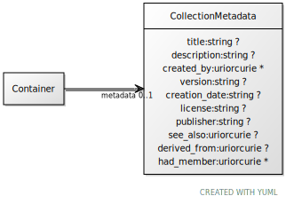

# Class: CollectionMetadata

URI: [ccf:CollectionMetadata](http://purl.org/ccf/CollectionMetadata)

## Referenced by Class

 *  **None** *[➞metadata](container__metadata.md)*  0..1  **[CollectionMetadata](CollectionMetadata.md)**

## Attributes

### Own

 * [title](title.md)  0..1
     * Range: [String](types/String.md)
 * [description](description.md)  0..1
     * Range: [String](types/String.md)
 * [created_by](created_by.md)  0..\*
     * Range: [Uriorcurie](types/Uriorcurie.md)
 * [version](version.md)  0..1
     * Range: [String](types/String.md)
 * [creation_date](creation_date.md)  0..1
     * Range: [String](types/String.md)
 * [license](license.md)  0..1
     * Range: [String](types/String.md)
 * [publisher](publisher.md)  0..1
     * Range: [String](types/String.md)
 * [see_also](see_also.md)  0..1
     * Range: [Uriorcurie](types/Uriorcurie.md)
 * [derived_from](derived_from.md)  0..1
     * Range: [Uriorcurie](types/Uriorcurie.md)
 * [had_member](had_member.md)  0..\*
     * Range: [Uriorcurie](types/Uriorcurie.md)

## Other properties

|  |  |  |
| --- | --- | --- |
| **Mappings:** | | dcat:Dataset |