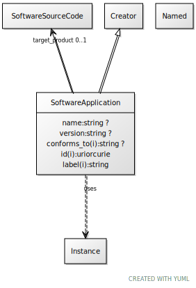

# Class: SoftwareApplication

URI: [dcat:SoftwareApplication](http://www.w3.org/ns/dcat#SoftwareApplication)

## Parents

 *  is_a: [Creator](Creator.md)

## Uses Mixin

 *  mixin: [Instance](Instance.md)

## Attributes

### Own

 * [name](name.md)  0..1
     * Range: [String](types/String.md)
 * [version](version.md)  0..1
     * Range: [String](types/String.md)
 * [target_product](target_product.md)  0..1
     * Range: [SoftwareSourceCode](SoftwareSourceCode.md)

### Inherited from Creator:

 * [conforms_to](conforms_to.md)  0..1
     * Range: [String](types/String.md)

### Mixed in from Instance:

 * [type_of](type_of.md)  0..\*
     * Range: [Named](Named.md)

## Other properties

|  |  |  |
| --- | --- | --- |
| **Mappings:** | | schema:SoftwareApplication |