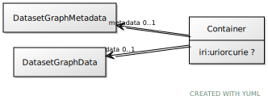

# Class: Container

URI: [ccf:Container](http://purl.org/ccf/Container)

## Attributes

### Own

 * [➞iri](container__iri.md)  0..1
     * Range: [Uriorcurie](types/Uriorcurie.md)
 * [➞metadata](container__metadata.md)  0..1
     * Range: [DatasetGraphMetadata](DatasetGraphMetadata.md)
 * [➞data](container__data.md)  0..1
     * Range: [DatasetGraphData](DatasetGraphData.md)
