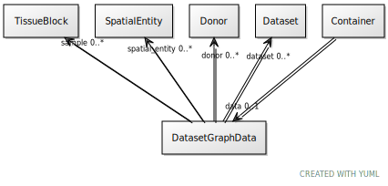

# Class: DatasetGraphData

URI: [ccf:DatasetGraphData](http://purl.org/ccf/DatasetGraphData)

## Referenced by Class

 *  **None** *[➞data](container__data.md)*  0..1  **[DatasetGraphData](DatasetGraphData.md)**

## Attributes

### Own

 * [donor](donor.md)  0..\*
     * Range: [Donor](Donor.md)
 * [sample](sample.md)  0..\*
     * Range: [TissueBlock](TissueBlock.md)
 * [dataset](dataset.md)  0..\*
     * Range: [ExperimentalDataset](ExperimentalDataset.md)
 * [spatial_entity](spatial_entity.md)  0..\*
     * Range: [SpatialEntity](SpatialEntity.md)
