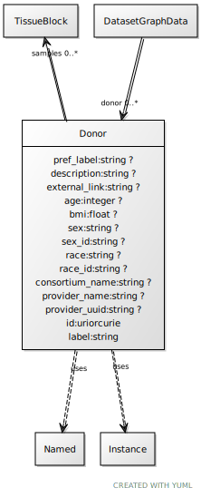

# Class: Donor

URI: [ccf:Donor](http://purl.org/ccf/Donor)

## Uses Mixin

 *  mixin: [Named](Named.md)
 *  mixin: [Instance](Instance.md)

## Referenced by Class

 *  **None** *[donor](donor.md)*  0..\*  **[Donor](Donor.md)**

## Attributes

### Own

 * [pref_label](pref_label.md)  0..1
     * Range: [String](types/String.md)
 * [description](description.md)  0..1
     * Range: [String](types/String.md)
 * [external_link](external_link.md)  0..1
     * Range: [String](types/String.md)
 * [age](age.md)  0..1
     * Range: [Integer](types/Integer.md)
 * [bmi](bmi.md)  0..1
     * Range: [Float](types/Float.md)
 * [Donor➞sex](Donor_sex.md)  0..1
     * Range: [String](types/String.md)
 * [Donor➞sex_id](Donor_sex_id.md)  0..1
     * Range: [String](types/String.md)
 * [Donor➞race](Donor_race.md)  0..1
     * Range: [String](types/String.md)
 * [Donor➞race_id](Donor_race_id.md)  0..1
     * Range: [String](types/String.md)
 * [consortium_name](consortium_name.md)  0..1
     * Range: [String](types/String.md)
 * [provider_name](provider_name.md)  0..1
     * Range: [String](types/String.md)
 * [provider_uuid](provider_uuid.md)  0..1
     * Range: [String](types/String.md)
 * [samples](samples.md)  0..\*
     * Range: [TissueBlock](TissueBlock.md)

### Mixed in from Named:

 * [id](id.md)  1..1
     * Range: [Uriorcurie](types/Uriorcurie.md)

### Mixed in from Named:

 * [label](label.md)  1..1
     * Range: [String](types/String.md)

### Mixed in from Instance:

 * [type_of](type_of.md)  0..\*
     * Range: [Named](Named.md)

## Other properties

|  |  |  |
| --- | --- | --- |
| **Mappings:** | | ccf:Donor |