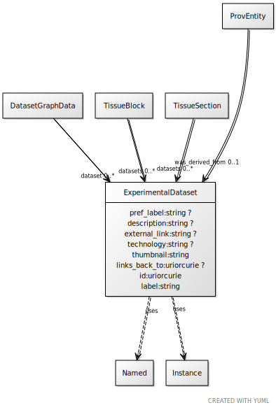

# Class: ExperimentalDataset

URI: [ccf:ExperimentalDataset](http://purl.org/ccf/ExperimentalDataset)

## Uses Mixin

 *  mixin: [Named](Named.md)
 *  mixin: [Instance](Instance.md)

## Referenced by Class

 *  **None** *[dataset](dataset.md)*  0..\*  **[ExperimentalDataset](ExperimentalDataset.md)**
 *  **None** *[datasets](datasets.md)*  0..\*  **[ExperimentalDataset](ExperimentalDataset.md)**
 *  **None** *[was_derived_from](was_derived_from.md)*  0..1  **[ExperimentalDataset](ExperimentalDataset.md)**

## Attributes

### Own

 * [pref_label](pref_label.md)  0..1
     * Range: [String](types/String.md)
 * [description](description.md)  0..1
     * Range: [String](types/String.md)
 * [external_link](external_link.md)  0..1
     * Range: [String](types/String.md)
 * [technology](technology.md)  0..1
     * Range: [String](types/String.md)
 * [thumbnail](thumbnail.md)  1..1
     * Range: [String](types/String.md)
 * [links_back_to](links_back_to.md)  0..1
     * Range: [Uriorcurie](types/Uriorcurie.md)

### Mixed in from Named:

 * [id](id.md)  1..1
     * Range: [Uriorcurie](types/Uriorcurie.md)

### Mixed in from Named:

 * [label](label.md)  1..1
     * Range: [String](types/String.md)

### Mixed in from Instance:

 * [type_of](type_of.md)  0..\*
     * Range: [Named](Named.md)

## Other properties

|  |  |  |
| --- | --- | --- |
| **Mappings:** | | ccf:Dataset |