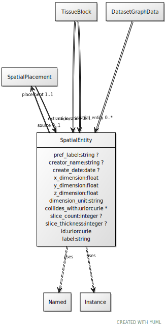

# Class: SpatialEntity

URI: [ccf:SpatialEntity](http://purl.org/ccf/SpatialEntity)

## Uses Mixin

 *  mixin: [Named](Named.md)
 *  mixin: [Instance](Instance.md)

## Referenced by Class

 *  **None** *[extraction_site](extraction_site.md)*  0..1  **[SpatialEntity](SpatialEntity.md)**
 *  **None** *[rui_location](rui_location.md)*  0..1  **[SpatialEntity](SpatialEntity.md)**
 *  **None** *[source](source.md)*  0..1  **[SpatialEntity](SpatialEntity.md)**
 *  **None** *[spatial_entity](spatial_entity.md)*  0..\*  **[SpatialEntity](SpatialEntity.md)**

## Attributes

### Own

 * [pref_label](pref_label.md)  0..1
     * Range: [String](types/String.md)
 * [creator_name](creator_name.md)  0..1
     * Range: [String](types/String.md)
 * [create_date](create_date.md)  0..1
     * Range: [Date](types/Date.md)
 * [x_dimension](x_dimension.md)  1..1
     * Range: [Float](types/Float.md)
 * [y_dimension](y_dimension.md)  1..1
     * Range: [Float](types/Float.md)
 * [z_dimension](z_dimension.md)  1..1
     * Range: [Float](types/Float.md)
 * [SpatialEntity➞dimension_unit](SpatialEntity_dimension_unit.md)  1..1
     * Range: [String](types/String.md)
 * [collides_with](collides_with.md)  0..\*
     * Range: [Uriorcurie](types/Uriorcurie.md)
 * [slice_count](slice_count.md)  0..1
     * Range: [Integer](types/Integer.md)
 * [slice_thickness](slice_thickness.md)  0..1
     * Range: [Integer](types/Integer.md)
 * [placement](placement.md)  1..1
     * Range: [SpatialPlacement](SpatialPlacement.md)

### Mixed in from Named:

 * [id](id.md)  1..1
     * Range: [Uriorcurie](types/Uriorcurie.md)

### Mixed in from Named:

 * [label](label.md)  1..1
     * Range: [String](types/String.md)

### Mixed in from Instance:

 * [type_of](type_of.md)  0..\*
     * Range: [Named](Named.md)

## Other properties

|  |  |  |
| --- | --- | --- |
| **Mappings:** | | ccf:SpatialEntity |