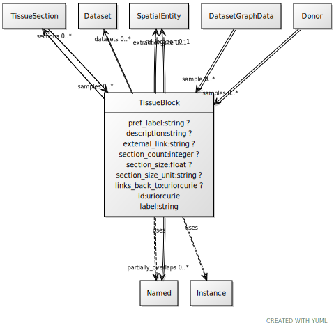

# Class: TissueBlock

URI: [ccf:TissueBlock](http://purl.org/ccf/TissueBlock)

## Uses Mixin

 *  mixin: [Named](Named.md)
 *  mixin: [Instance](Instance.md)

## Referenced by Class

 *  **None** *[sample](sample.md)*  0..\*  **[TissueBlock](TissueBlock.md)**
 *  **None** *[samples](samples.md)*  0..\*  **[TissueBlock](TissueBlock.md)**

## Attributes

### Own

 * [TissueBlock➞partially_overlaps](TissueBlock_partially_overlaps.md)  0..\*
     * Range: [Named](Named.md)
 * [pref_label](pref_label.md)  0..1
     * Range: [String](types/String.md)
 * [description](description.md)  0..1
     * Range: [String](types/String.md)
 * [rui_location](rui_location.md)  0..1
     * Range: [SpatialEntity](SpatialEntity.md)
 * [extraction_site](extraction_site.md)  0..1
     * Range: [SpatialEntity](SpatialEntity.md)
 * [external_link](external_link.md)  0..1
     * Range: [String](types/String.md)
 * [sections](sections.md)  0..\*
     * Range: [TissueSection](TissueSection.md)
 * [datasets](datasets.md)  0..\*
     * Range: [ExperimentalDataset](ExperimentalDataset.md)
 * [section_count](section_count.md)  0..1
     * Range: [Integer](types/Integer.md)
 * [section_size](section_size.md)  0..1
     * Range: [Float](types/Float.md)
 * [section_size_unit](section_size_unit.md)  0..1
     * Range: [String](types/String.md)
 * [links_back_to](links_back_to.md)  0..1
     * Range: [Uriorcurie](types/Uriorcurie.md)

### Mixed in from Named:

 * [id](id.md)  1..1
     * Range: [Uriorcurie](types/Uriorcurie.md)

### Mixed in from Named:

 * [label](label.md)  1..1
     * Range: [String](types/String.md)

### Mixed in from Instance:

 * [type_of](type_of.md)  0..\*
     * Range: [Named](Named.md)

## Other properties

|  |  |  |
| --- | --- | --- |
| **Mappings:** | | ccf:TissueBlock |