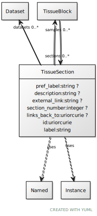

# Class: TissueSection

URI: [ccf:TissueSection](http://purl.org/ccf/TissueSection)

## Uses Mixin

 *  mixin: [Named](Named.md)
 *  mixin: [Instance](Instance.md)

## Referenced by Class

 *  **None** *[sections](sections.md)*  0..\*  **[TissueSection](TissueSection.md)**

## Attributes

### Own

 * [pref_label](pref_label.md)  0..1
     * Range: [String](types/String.md)
 * [description](description.md)  0..1
     * Range: [String](types/String.md)
 * [external_link](external_link.md)  0..1
     * Range: [String](types/String.md)
 * [samples](samples.md)  0..\*
     * Range: [TissueBlock](TissueBlock.md)
 * [datasets](datasets.md)  0..\*
     * Range: [Dataset](Dataset.md)
 * [section_number](section_number.md)  0..1
     * Range: [Integer](types/Integer.md)
 * [links_back_to](links_back_to.md)  0..1
     * Range: [Uriorcurie](types/Uriorcurie.md)

### Mixed in from Named:

 * [id](id.md)  1..1
     * Range: [Uriorcurie](types/Uriorcurie.md)

### Mixed in from Named:

 * [label](label.md)  1..1
     * Range: [String](types/String.md)

### Mixed in from Instance:

 * [type_of](type_of.md)  0..\*
     * Range: [Named](Named.md)

## Other properties

|  |  |  |
| --- | --- | --- |
| **Mappings:** | | ccf:TissueSection |