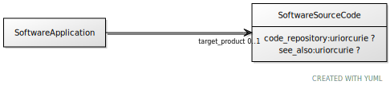

# Class: SoftwareSourceCode

URI: [ccf:SoftwareSourceCode](http://purl.org/ccf/SoftwareSourceCode)

## Referenced by Class

 *  **None** *[target_product](target_product.md)*  0..1  **[SoftwareSourceCode](SoftwareSourceCode.md)**

## Attributes

### Own

 * [code_repository](code_repository.md)  0..1
     * Range: [Uriorcurie](types/Uriorcurie.md)
 * [see_also](see_also.md)  0..1
     * Range: [Uriorcurie](types/Uriorcurie.md)

## Other properties

|  |  |  |
| --- | --- | --- |
| **Mappings:** | | schema:SoftwareSourceCode |