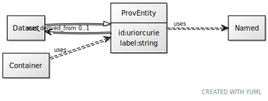

# Class: ProvEntity

URI: [dcat:ProvEntity](http://www.w3.org/ns/dcat#ProvEntity)

## Uses Mixin

 *  mixin: [Named](Named.md)

## Children

 * [Dataset](Dataset.md)

## Mixin for

 * [Container](Container.md) (mixin) 

## Referenced by Class

## Attributes

### Own

 * [was_derived_from](was_derived_from.md)  0..1
     * Range: [Dataset](Dataset.md)

### Mixed in from Named:

 * [id](id.md)  1..1
     * Range: [Uriorcurie](types/Uriorcurie.md)

### Mixed in from Named:

 * [label](label.md)  1..1
     * Range: [String](types/String.md)

## Other properties

|  |  |  |
| --- | --- | --- |
| **Mappings:** | | prov:Entity |