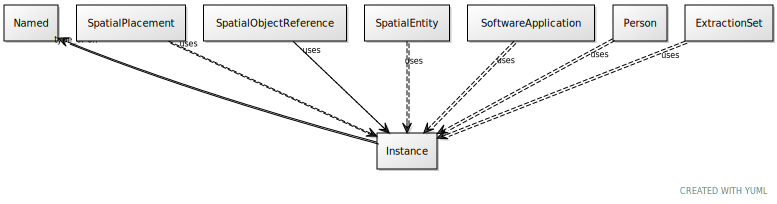

# Class: Instance

URI: [ccf:Instance](http://purl.org/ccf/Instance)

## Mixin for

 * [ExtractionSet](ExtractionSet.md) (mixin) 
 * [Person](Person.md) (mixin) 
 * [SoftwareApplication](SoftwareApplication.md) (mixin) 
 * [SpatialEntity](SpatialEntity.md) (mixin) 
 * [SpatialObjectReference](SpatialObjectReference.md) (mixin) 
 * [SpatialPlacement](SpatialPlacement.md) (mixin) 

## Referenced by Class

## Attributes

### Own

 * [type_of](type_of.md)  0..\*
     * Range: [Named](Named.md)
