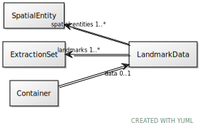

# Class: LandmarkData

URI: [ccf:LandmarkData](http://purl.org/ccf/LandmarkData)

## Referenced by Class

 *  **None** *[➞data](container__data.md)*  0..1  **[LandmarkData](LandmarkData.md)**

## Attributes

### Own

 * [landmarks](landmarks.md)  1..\*
     * Range: [ExtractionSet](ExtractionSet.md)
 * [spatial_entities](spatial_entities.md)  1..\*
     * Range: [SpatialEntity](SpatialEntity.md)
