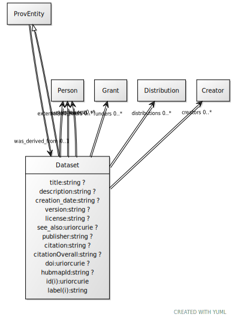

# Class: Dataset

URI: [dcat:Dataset](http://www.w3.org/ns/dcat#Dataset)

## Parents

 *  is_a: [ProvEntity](ProvEntity.md)

## Referenced by Class

 *  **None** *[was_derived_from](was_derived_from.md)*  0..1  **[Dataset](Dataset.md)**

## Attributes

### Own

 * [title](title.md)  0..1
     * Range: [String](types/String.md)
 * [description](description.md)  0..1
     * Range: [String](types/String.md)
 * [creators](creators.md)  0..\*
     * Range: [Creator](Creator.md)
 * [reviewers](reviewers.md)  0..\*
     * Range: [Person](Person.md)
 * [creation_date](creation_date.md)  0..1
     * Range: [String](types/String.md)
 * [version](version.md)  0..1
     * Range: [String](types/String.md)
 * [license](license.md)  0..1
     * Range: [String](types/String.md)
 * [see_also](see_also.md)  0..1
     * Range: [Uriorcurie](types/Uriorcurie.md)
 * [publisher](publisher.md)  0..1
     * Range: [String](types/String.md)
 * [citation](citation.md)  0..1
     * Range: [String](types/String.md)
 * [citationOverall](citationOverall.md)  0..1
     * Range: [String](types/String.md)
 * [funders](funders.md)  0..\*
     * Range: [Grant](Grant.md)
 * [doi](doi.md)  0..1
     * Range: [Uriorcurie](types/Uriorcurie.md)
 * [hubmapId](hubmapId.md)  0..1
     * Range: [String](types/String.md)
 * [project_leads](project_leads.md)  0..\*
     * Range: [Person](Person.md)
 * [externalReviewers](externalReviewers.md)  0..\*
     * Range: [Person](Person.md)
 * [distributions](distributions.md)  0..\*
     * Range: [Distribution](Distribution.md)

### Inherited from ProvEntity:

 * [was_derived_from](was_derived_from.md)  0..1
     * Range: [Dataset](Dataset.md)

## Other properties

|  |  |  |
| --- | --- | --- |
| **Mappings:** | | dcat:Dataset |