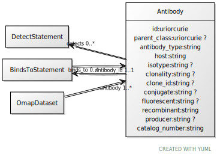

# Class: Antibody

URI: [ccf:Antibody](http://purl.org/ccf/Antibody)

## Referenced by Class

 *  **None** *[antibody](antibody.md)*  1..\*  **[Antibody](Antibody.md)**
 *  **None** *[antibody_id](antibody_id.md)*  1..1  **[Antibody](Antibody.md)**

## Attributes

### Own

 * [Antibody➞id](Antibody_id.md)  1..1
     * Range: [Uriorcurie](types/Uriorcurie.md)
 * [parent_class](parent_class.md)  0..1
     * Range: [Uriorcurie](types/Uriorcurie.md)
 * [Antibody➞antibody_type](Antibody_antibody_type.md)  1..1
     * Range: [String](types/String.md)
 * [host](host.md)  1..1
     * Range: [String](types/String.md)
 * [isotype](isotype.md)  0..1
     * Range: [String](types/String.md)
 * [clonality](clonality.md)  0..1
     * Range: [String](types/String.md)
 * [clone_id](clone_id.md)  0..1
     * Range: [String](types/String.md)
 * [conjugate](conjugate.md)  0..1
     * Range: [String](types/String.md)
 * [fluorescent](fluorescent.md)  0..1
     * Range: [String](types/String.md)
 * [recombinant](recombinant.md)  1..1
     * Range: [String](types/String.md)
 * [producer](producer.md)  0..1
     * Range: [String](types/String.md)
 * [catalog_number](catalog_number.md)  1..1
     * Range: [String](types/String.md)
 * [detects](detects.md)  0..\*
     * Range: [DetectStatement](DetectStatement.md)
 * [binds_to](binds_to.md)  0..\*
     * Range: [BindsToStatement](BindsToStatement.md)
