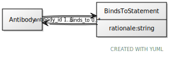

# Class: BindsToStatement

URI: [ccf:BindsToStatement](http://purl.org/ccf/BindsToStatement)

## Referenced by Class

 *  **None** *[binds_to](binds_to.md)*  0..\*  **[BindsToStatement](BindsToStatement.md)**

## Attributes

### Own

 * [antibody_id](antibody_id.md)  1..1
     * Range: [Antibody](Antibody.md)
 * [rationale](rationale.md)  1..1
     * Range: [String](types/String.md)
