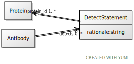

# Class: DetectStatement

URI: [ccf:DetectStatement](http://purl.org/ccf/DetectStatement)

## Referenced by Class

 *  **None** *[detects](detects.md)*  0..\*  **[DetectStatement](DetectStatement.md)**

## Attributes

### Own

 * [protein_id](protein_id.md)  1..\*
     * Range: [Protein](Protein.md)
 * [rationale](rationale.md)  1..1
     * Range: [String](types/String.md)
