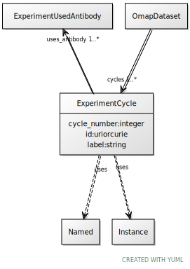

# Class: ExperimentCycle

URI: [ccf:ExperimentCycle](http://purl.org/ccf/ExperimentCycle)

## Uses Mixin

 *  mixin: [Named](Named.md)
 *  mixin: [Instance](Instance.md)

## Referenced by Class

 *  **None** *[cycles](cycles.md)*  1..\*  **[ExperimentCycle](ExperimentCycle.md)**

## Attributes

### Own

 * [cycle_number](cycle_number.md)  1..1
     * Range: [Integer](types/Integer.md)
 * [uses_antibody](uses_antibody.md)  1..\*
     * Range: [ExperimentUsedAntibody](ExperimentUsedAntibody.md)

### Mixed in from Named:

 * [id](id.md)  1..1
     * Range: [Uriorcurie](types/Uriorcurie.md)

### Mixed in from Named:

 * [label](label.md)  1..1
     * Range: [String](types/String.md)

### Mixed in from Instance:

 * [type_of](type_of.md)  0..\*
     * Range: [Named](Named.md)

## Other properties

|  |  |  |
| --- | --- | --- |
| **Mappings:** | | ccf:ExperimentCycle |