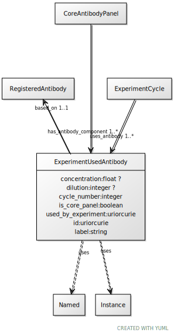

# Class: ExperimentUsedAntibody

URI: [ccf:ExperimentUsedAntibody](http://purl.org/ccf/ExperimentUsedAntibody)

## Uses Mixin

 *  mixin: [Named](Named.md)
 *  mixin: [Instance](Instance.md)

## Referenced by Class

 *  **None** *[has_antibody_component](has_antibody_component.md)*  1..\*  **[ExperimentUsedAntibody](ExperimentUsedAntibody.md)**
 *  **None** *[uses_antibody](uses_antibody.md)*  1..\*  **[ExperimentUsedAntibody](ExperimentUsedAntibody.md)**

## Attributes

### Own

 * [concentration](concentration.md)  0..1
     * Range: [Float](types/Float.md)
 * [dilution](dilution.md)  0..1
     * Range: [Integer](types/Integer.md)
 * [cycle_number](cycle_number.md)  1..1
     * Range: [Integer](types/Integer.md)
 * [is_core_panel](is_core_panel.md)  1..1
     * Range: [Boolean](types/Boolean.md)
 * [used_by_experiment](used_by_experiment.md)  1..1
     * Range: [Uriorcurie](types/Uriorcurie.md)
 * [based_on](based_on.md)  1..1
     * Range: [RegisteredAntibody](RegisteredAntibody.md)

### Mixed in from Named:

 * [id](id.md)  1..1
     * Range: [Uriorcurie](types/Uriorcurie.md)

### Mixed in from Named:

 * [label](label.md)  1..1
     * Range: [String](types/String.md)

### Mixed in from Instance:

 * [type_of](type_of.md)  0..\*
     * Range: [Named](Named.md)

## Other properties

|  |  |  |
| --- | --- | --- |
| **Mappings:** | | ccf:ExperimentUsedAntibody |