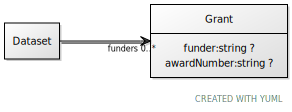

# Class: Grant

URI: [ccf:Grant](http://purl.org/ccf/Grant)

## Referenced by Class

 *  **None** *[funders](funders.md)*  0..\*  **[Grant](Grant.md)**

## Attributes

### Own

 * [funder](funder.md)  0..1
     * Range: [String](types/String.md)
 * [awardNumber](awardNumber.md)  0..1
     * Range: [String](types/String.md)

## Other properties

|  |  |  |
| --- | --- | --- |
| **Mappings:** | | schema:Grant |