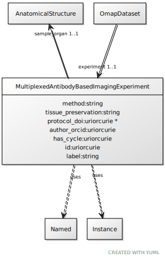

# Class: MultiplexedAntibodyBasedImagingExperiment

URI: [ccf:MultiplexedAntibodyBasedImagingExperiment](http://purl.org/ccf/MultiplexedAntibodyBasedImagingExperiment)

## Uses Mixin

 *  mixin: [Named](Named.md)
 *  mixin: [Instance](Instance.md)

## Referenced by Class

 *  **None** *[experiment](experiment.md)*  1..1  **[MultiplexedAntibodyBasedImagingExperiment](MultiplexedAntibodyBasedImagingExperiment.md)**

## Attributes

### Own

 * [method](method.md)  1..1
     * Range: [String](types/String.md)
 * [tissue_preservation](tissue_preservation.md)  1..1
     * Range: [String](types/String.md)
 * [MultiplexedAntibodyBasedImagingExperiment➞protocol_doi](MultiplexedAntibodyBasedImagingExperiment_protocol_doi.md)  0..\*
     * Range: [Uriorcurie](types/Uriorcurie.md)
 * [MultiplexedAntibodyBasedImagingExperiment➞author_orcid](MultiplexedAntibodyBasedImagingExperiment_author_orcid.md)  1..\*
     * Range: [Uriorcurie](types/Uriorcurie.md)
 * [has_cycle](has_cycle.md)  1..\*
     * Range: [Uriorcurie](types/Uriorcurie.md)
 * [sample_organ](sample_organ.md)  1..1
     * Range: [AnatomicalStructure](AnatomicalStructure.md)

### Mixed in from Named:

 * [id](id.md)  1..1
     * Range: [Uriorcurie](types/Uriorcurie.md)

### Mixed in from Named:

 * [label](label.md)  1..1
     * Range: [String](types/String.md)

### Mixed in from Instance:

 * [type_of](type_of.md)  0..\*
     * Range: [Named](Named.md)

## Other properties

|  |  |  |
| --- | --- | --- |
| **Mappings:** | | ccf:MultiplexedAntibodyBasedImagingExperiment |