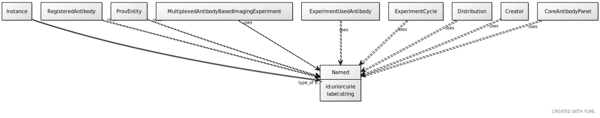

# Class: Named

URI: [ccf:Named](http://purl.org/ccf/Named)

## Mixin for

 * [CoreAntibodyPanel](CoreAntibodyPanel.md) (mixin) 
 * [Creator](Creator.md) (mixin) 
 * [Distribution](Distribution.md) (mixin) 
 * [ExperimentCycle](ExperimentCycle.md) (mixin) 
 * [ExperimentUsedAntibody](ExperimentUsedAntibody.md) (mixin) 
 * [MultiplexedAntibodyBasedImagingExperiment](MultiplexedAntibodyBasedImagingExperiment.md) (mixin) 
 * [ProvEntity](ProvEntity.md) (mixin) 
 * [RegisteredAntibody](RegisteredAntibody.md) (mixin) 

## Referenced by Class

 *  **None** *[type_of](type_of.md)*  0..\*  **[Named](Named.md)**

## Attributes

### Own

 * [id](id.md)  1..1
     * Range: [Uriorcurie](types/Uriorcurie.md)
 * [label](label.md)  1..1
     * Range: [String](types/String.md)
