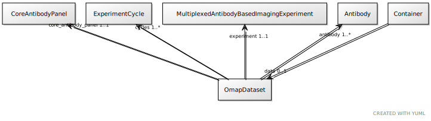

# Class: OmapDataset

URI: [ccf:OmapDataset](http://purl.org/ccf/OmapDataset)

## Referenced by Class

 *  **None** *[➞data](container__data.md)*  0..1  **[OmapDataset](OmapDataset.md)**

## Attributes

### Own

 * [antibody](antibody.md)  1..\*
     * Range: [Antibody](Antibody.md)
 * [experiment](experiment.md)  1..1
     * Range: [MultiplexedAntibodyBasedImagingExperiment](MultiplexedAntibodyBasedImagingExperiment.md)
 * [cycles](cycles.md)  1..\*
     * Range: [ExperimentCycle](ExperimentCycle.md)
 * [core_antibody_panel](core_antibody_panel.md)  1..1
     * Range: [CoreAntibodyPanel](CoreAntibodyPanel.md)
