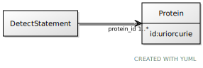

# Class: Protein

URI: [ccf:Protein](http://purl.org/ccf/Protein)

## Referenced by Class

 *  **None** *[protein_id](protein_id.md)*  1..\*  **[Protein](Protein.md)**

## Attributes

### Own

 * [Protein➞id](Protein_id.md)  1..1
     * Range: [Uriorcurie](types/Uriorcurie.md)
