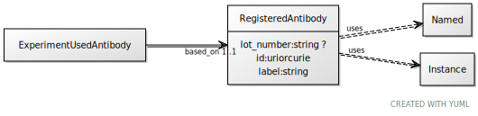

# Class: RegisteredAntibody

URI: [ccf:RegisteredAntibody](http://purl.org/ccf/RegisteredAntibody)

## Uses Mixin

 *  mixin: [Named](Named.md)
 *  mixin: [Instance](Instance.md)

## Referenced by Class

 *  **None** *[based_on](based_on.md)*  1..1  **[RegisteredAntibody](RegisteredAntibody.md)**

## Attributes

### Own

 * [lot_number](lot_number.md)  0..1
     * Range: [String](types/String.md)

### Mixed in from Named:

 * [id](id.md)  1..1
     * Range: [Uriorcurie](types/Uriorcurie.md)

### Mixed in from Named:

 * [label](label.md)  1..1
     * Range: [String](types/String.md)

### Mixed in from Instance:

 * [type_of](type_of.md)  0..\*
     * Range: [Named](Named.md)
