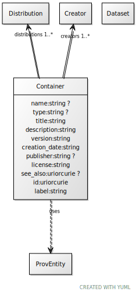

# Class: Container

URI: [dcat:Container](http://www.w3.org/ns/dcat#Container)

## Uses Mixin

 *  mixin: [ProvEntity](ProvEntity.md)

## Referenced by Class

## Attributes

### Own

 * [name](name.md)  0..1
     * Range: [String](types/String.md)
 * [type](type.md)  0..1
     * Range: [String](types/String.md)
 * [Container➞title](Container_title.md)  1..1
     * Range: [String](types/String.md)
 * [Container➞description](Container_description.md)  1..1
     * Range: [String](types/String.md)
 * [Container➞version](Container_version.md)  1..1
     * Range: [String](types/String.md)
 * [Container➞creators](Container_creators.md)  1..\*
     * Range: [Creator](Creator.md)
 * [Container➞creation_date](Container_creation_date.md)  1..1
     * Range: [String](types/String.md)
 * [publisher](publisher.md)  0..1
     * Range: [String](types/String.md)
 * [Container➞license](Container_license.md)  1..1
     * Range: [String](types/String.md)
 * [see_also](see_also.md)  0..1
     * Range: [Uriorcurie](types/Uriorcurie.md)
 * [Container➞distributions](Container_distributions.md)  1..\*
     * Range: [Distribution](Distribution.md)

### Mixed in from ProvEntity:

 * [was_derived_from](was_derived_from.md)  0..1
     * Range: [Dataset](Dataset.md)

## Other properties

|  |  |  |
| --- | --- | --- |
| **Mappings:** | | dcat:Dataset |