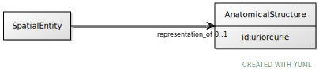

# Class: AnatomicalStructure

URI: [ccf:AnatomicalStructure](http://purl.org/ccf/AnatomicalStructure)

## Referenced by Class

 *  **None** *[representation_of](representation_of.md)*  0..1  **[AnatomicalStructure](AnatomicalStructure.md)**

## Attributes

### Own

 * [AnatomicalStructure➞id](AnatomicalStructure_id.md)  1..1
     * Range: [Uriorcurie](types/Uriorcurie.md)
