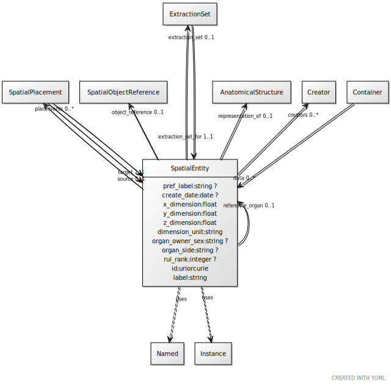

# Class: SpatialEntity

URI: [ccf:SpatialEntity](http://purl.org/ccf/SpatialEntity)

## Uses Mixin

 *  mixin: [Named](Named.md)
 *  mixin: [Instance](Instance.md)

## Referenced by Class

 *  **None** *[➞data](container__data.md)*  0..\*  **[SpatialEntity](SpatialEntity.md)**
 *  **None** *[extraction_set_for](extraction_set_for.md)*  1..1  **[SpatialEntity](SpatialEntity.md)**
 *  **None** *[reference_organ](reference_organ.md)*  0..1  **[SpatialEntity](SpatialEntity.md)**
 *  **None** *[source](source.md)*  0..1  **[SpatialEntity](SpatialEntity.md)**
 *  **None** *[target](target.md)*  1..1  **[SpatialEntity](SpatialEntity.md)**

## Attributes

### Own

 * [pref_label](pref_label.md)  0..1
     * Range: [String](types/String.md)
 * [creators](creators.md)  0..\*
     * Range: [Creator](Creator.md)
 * [create_date](create_date.md)  0..1
     * Range: [Date](types/Date.md)
 * [x_dimension](x_dimension.md)  1..1
     * Range: [Float](types/Float.md)
 * [y_dimension](y_dimension.md)  1..1
     * Range: [Float](types/Float.md)
 * [z_dimension](z_dimension.md)  1..1
     * Range: [Float](types/Float.md)
 * [SpatialEntity➞dimension_unit](SpatialEntity_dimension_unit.md)  1..1
     * Range: [String](types/String.md)
 * [representation_of](representation_of.md)  0..1
     * Range: [AnatomicalStructure](AnatomicalStructure.md)
 * [SpatialEntity➞organ_owner_sex](SpatialEntity_organ_owner_sex.md)  0..1
     * Range: [String](types/String.md)
 * [SpatialEntity➞organ_side](SpatialEntity_organ_side.md)  0..1
     * Range: [String](types/String.md)
 * [object_reference](object_reference.md)  0..1
     * Range: [SpatialObjectReference](SpatialObjectReference.md)
 * [placements](placements.md)  0..\*
     * Range: [SpatialPlacement](SpatialPlacement.md)
 * [reference_organ](reference_organ.md)  0..1
     * Range: [SpatialEntity](SpatialEntity.md)
 * [extraction_set](extraction_set.md)  0..1
     * Range: [ExtractionSet](ExtractionSet.md)
 * [rui_rank](rui_rank.md)  0..1
     * Range: [Integer](types/Integer.md)

### Mixed in from Named:

 * [id](id.md)  1..1
     * Range: [Uriorcurie](types/Uriorcurie.md)

### Mixed in from Named:

 * [label](label.md)  1..1
     * Range: [String](types/String.md)

### Mixed in from Instance:

 * [type_of](type_of.md)  0..\*
     * Range: [Named](Named.md)

## Other properties

|  |  |  |
| --- | --- | --- |
| **Mappings:** | | ccf:SpatialEntity |