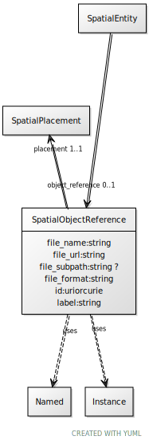

# Class: SpatialObjectReference

URI: [ccf:SpatialObjectReference](http://purl.org/ccf/SpatialObjectReference)

## Uses Mixin

 *  mixin: [Named](Named.md)
 *  mixin: [Instance](Instance.md)

## Referenced by Class

 *  **None** *[object_reference](object_reference.md)*  0..1  **[SpatialObjectReference](SpatialObjectReference.md)**

## Attributes

### Own

 * [file_name](file_name.md)  1..1
     * Range: [String](types/String.md)
 * [file_url](file_url.md)  1..1
     * Range: [String](types/String.md)
 * [file_subpath](file_subpath.md)  0..1
     * Range: [String](types/String.md)
 * [file_format](file_format.md)  1..1
     * Range: [String](types/String.md)
 * [placement](placement.md)  1..1
     * Range: [SpatialPlacement](SpatialPlacement.md)

### Mixed in from Named:

 * [id](id.md)  1..1
     * Range: [Uriorcurie](types/Uriorcurie.md)

### Mixed in from Named:

 * [label](label.md)  1..1
     * Range: [String](types/String.md)

### Mixed in from Instance:

 * [type_of](type_of.md)  0..\*
     * Range: [Named](Named.md)

## Other properties

|  |  |  |
| --- | --- | --- |
| **Mappings:** | | ccf:SpatialObjectReference |