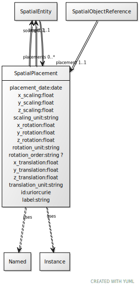

# Class: SpatialPlacement

URI: [ccf:SpatialPlacement](http://purl.org/ccf/SpatialPlacement)

## Uses Mixin

 *  mixin: [Named](Named.md)
 *  mixin: [Instance](Instance.md)

## Referenced by Class

 *  **None** *[placement](placement.md)*  1..1  **[SpatialPlacement](SpatialPlacement.md)**
 *  **None** *[placements](placements.md)*  0..\*  **[SpatialPlacement](SpatialPlacement.md)**

## Attributes

### Own

 * [target](target.md)  1..1
     * Range: [SpatialEntity](SpatialEntity.md)
 * [source](source.md)  0..1
     * Range: [SpatialEntity](SpatialEntity.md)
 * [placement_date](placement_date.md)  1..1
     * Range: [Date](types/Date.md)
 * [x_scaling](x_scaling.md)  1..1
     * Range: [Float](types/Float.md)
 * [y_scaling](y_scaling.md)  1..1
     * Range: [Float](types/Float.md)
 * [z_scaling](z_scaling.md)  1..1
     * Range: [Float](types/Float.md)
 * [SpatialPlacement➞scaling_unit](SpatialPlacement_scaling_unit.md)  1..1
     * Range: [String](types/String.md)
 * [x_rotation](x_rotation.md)  1..1
     * Range: [Float](types/Float.md)
 * [y_rotation](y_rotation.md)  1..1
     * Range: [Float](types/Float.md)
 * [z_rotation](z_rotation.md)  1..1
     * Range: [Float](types/Float.md)
 * [SpatialPlacement➞rotation_unit](SpatialPlacement_rotation_unit.md)  1..1
     * Range: [String](types/String.md)
 * [SpatialPlacement➞rotation_order](SpatialPlacement_rotation_order.md)  0..1
     * Range: [String](types/String.md)
 * [x_translation](x_translation.md)  1..1
     * Range: [Float](types/Float.md)
 * [y_translation](y_translation.md)  1..1
     * Range: [Float](types/Float.md)
 * [z_translation](z_translation.md)  1..1
     * Range: [Float](types/Float.md)
 * [SpatialPlacement➞translation_unit](SpatialPlacement_translation_unit.md)  1..1
     * Range: [String](types/String.md)

### Mixed in from Named:

 * [id](id.md)  1..1
     * Range: [Uriorcurie](types/Uriorcurie.md)

### Mixed in from Named:

 * [label](label.md)  1..1
     * Range: [String](types/String.md)

### Mixed in from Instance:

 * [type_of](type_of.md)  0..\*
     * Range: [Named](Named.md)

## Other properties

|  |  |  |
| --- | --- | --- |
| **Mappings:** | | ccf:SpatialPlacement |