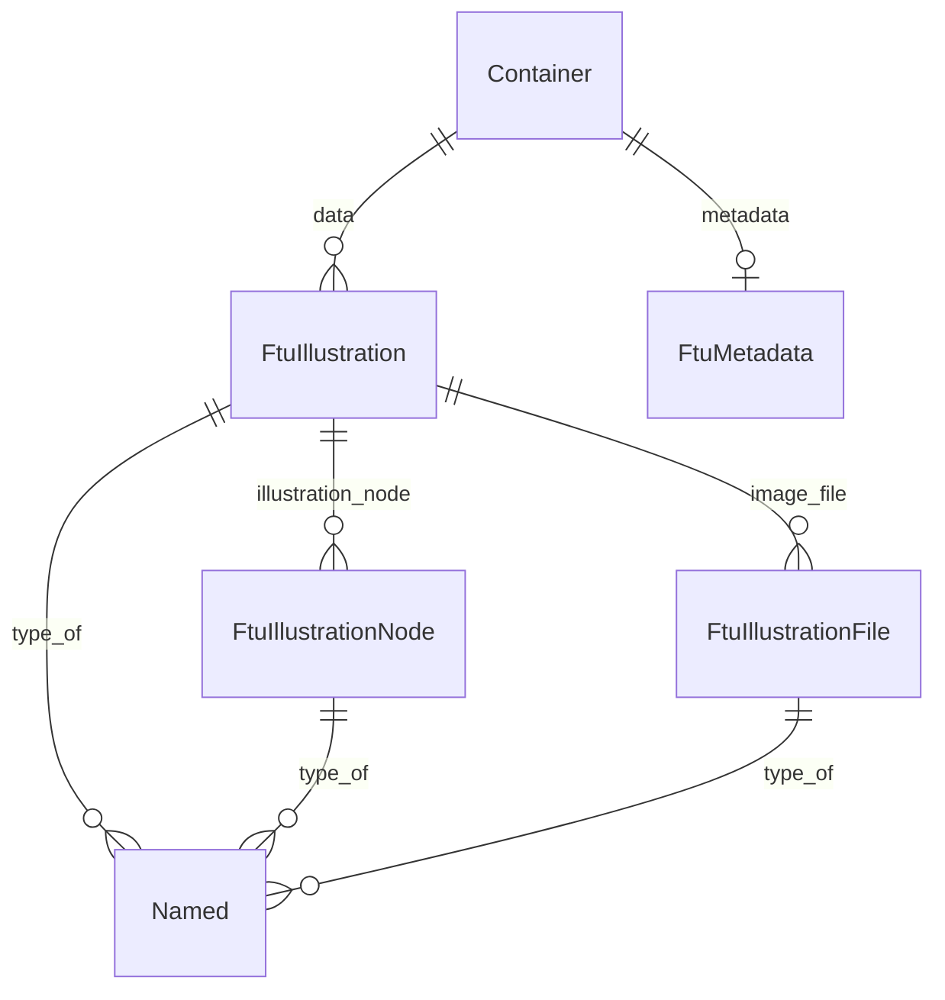
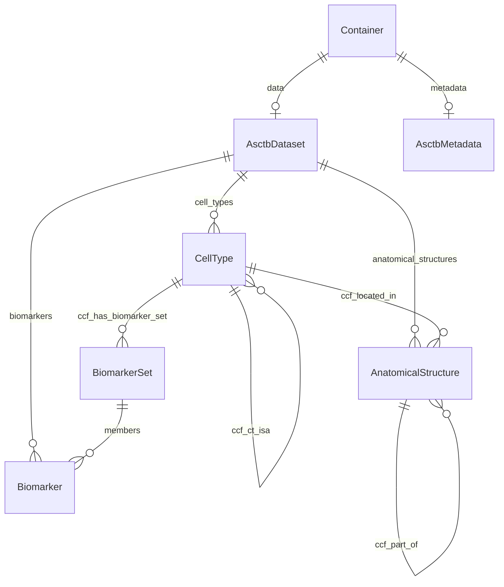
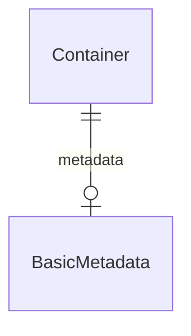
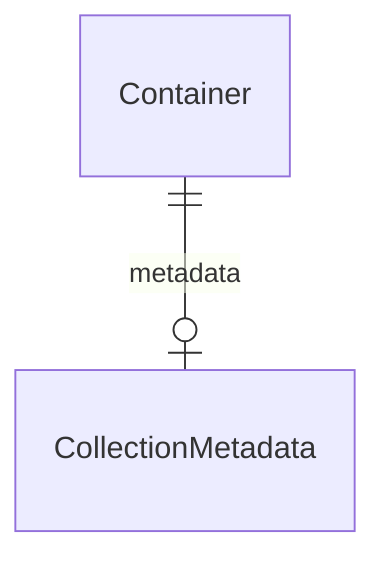
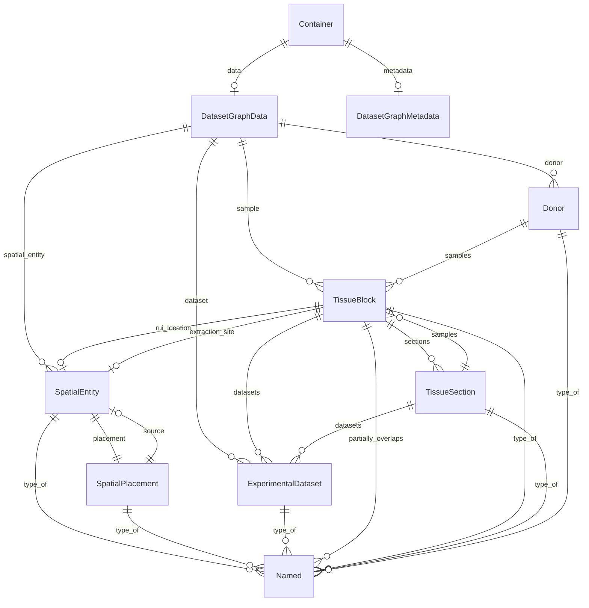
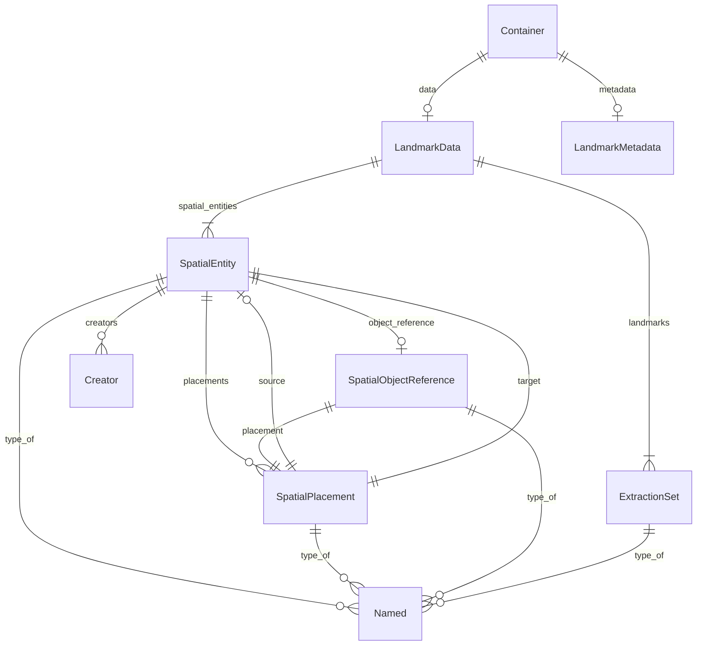
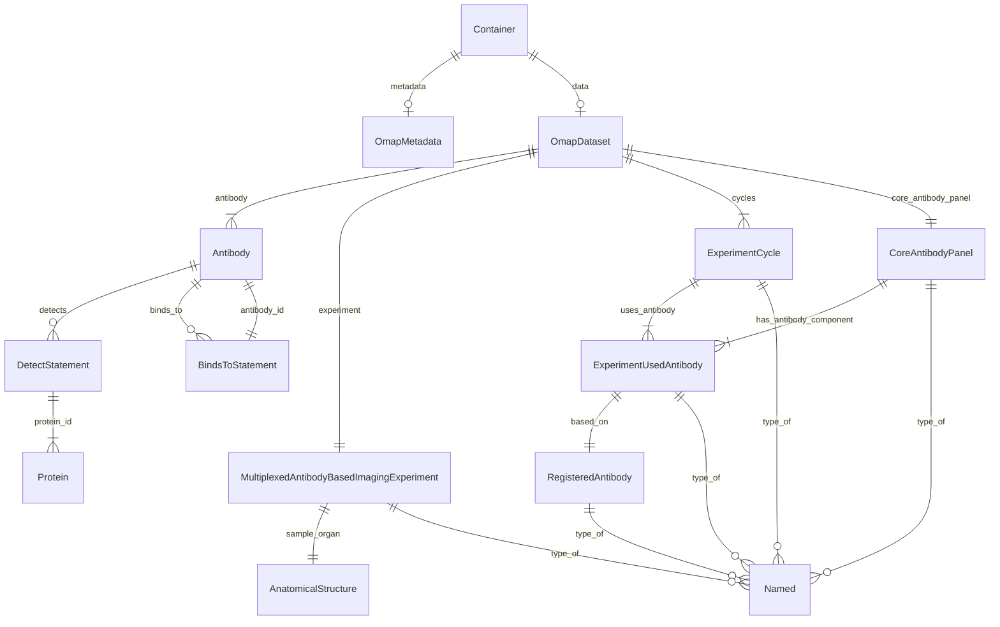
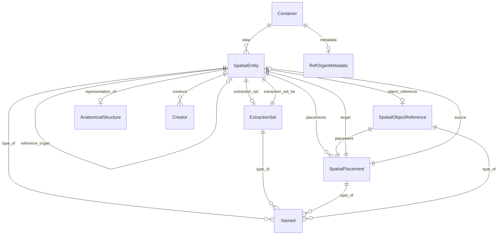

# HRA DO Processor Diagrams
## 2d-ftu

```mermaid
erDiagram
Container {

}
FtuIllustration {

}
Named {

}
FtuIllustrationNode {

}
FtuIllustrationFile {

}
FtuMetadata {

}

Container ||--|o FtuMetadata : "metadata"
Container ||--}o FtuIllustration : "data"
FtuIllustration ||--}o FtuIllustrationFile : "image_file"
FtuIllustration ||--}o FtuIllustrationNode : "illustration_node"
FtuIllustration ||--}o Named : "type_of"
FtuIllustrationNode ||--}o Named : "type_of"
FtuIllustrationFile ||--}o Named : "type_of"

```

## asct-b

```mermaid
erDiagram
Container {

}
AsctbDataset {

}
Biomarker {

}
CellType {

}
BiomarkerSet {

}
AnatomicalStructure {

}
AsctbMetadata {

}

Container ||--|o AsctbMetadata : "metadata"
Container ||--|o AsctbDataset : "data"
AsctbDataset ||--}o AnatomicalStructure : "anatomical_structures"
AsctbDataset ||--}o CellType : "cell_types"
AsctbDataset ||--}o Biomarker : "biomarkers"
CellType ||--}o CellType : "ccf_ct_isa"
CellType ||--}o AnatomicalStructure : "ccf_located_in"
CellType ||--}o BiomarkerSet : "ccf_has_biomarker_set"
BiomarkerSet ||--}o Biomarker : "members"
AnatomicalStructure ||--}o AnatomicalStructure : "ccf_part_of"

```

## basic

```mermaid
erDiagram
Container {

}
BasicMetadata {

}

Container ||--|o BasicMetadata : "metadata"

```

## collection

```mermaid
erDiagram
Container {

}
CollectionMetadata {

}

Container ||--|o CollectionMetadata : "metadata"

```

## ds-graph

```mermaid
erDiagram
Container {

}
DatasetGraphData {

}
SpatialEntity {

}
Named {

}
SpatialPlacement {

}
ExperimentalDataset {

}
TissueBlock {

}
TissueSection {

}
Donor {

}
DatasetGraphMetadata {

}

Container ||--|o DatasetGraphMetadata : "metadata"
Container ||--|o DatasetGraphData : "data"
DatasetGraphData ||--}o Donor : "donor"
DatasetGraphData ||--}o TissueBlock : "sample"
DatasetGraphData ||--}o ExperimentalDataset : "dataset"
DatasetGraphData ||--}o SpatialEntity : "spatial_entity"
SpatialEntity ||--|| SpatialPlacement : "placement"
SpatialEntity ||--}o Named : "type_of"
SpatialPlacement ||--|o SpatialEntity : "source"
SpatialPlacement ||--}o Named : "type_of"
ExperimentalDataset ||--}o Named : "type_of"
TissueBlock ||--}o Named : "partially_overlaps"
TissueBlock ||--|o SpatialEntity : "rui_location"
TissueBlock ||--|o SpatialEntity : "extraction_site"
TissueBlock ||--}o TissueSection : "sections"
TissueBlock ||--}o ExperimentalDataset : "datasets"
TissueBlock ||--}o Named : "type_of"
TissueSection ||--}o TissueBlock : "samples"
TissueSection ||--}o ExperimentalDataset : "datasets"
TissueSection ||--}o Named : "type_of"
Donor ||--}o TissueBlock : "samples"
Donor ||--}o Named : "type_of"

```

## graph

```mermaid
erDiagram
Container {

}
BasicMetadata {

}

Container ||--|o BasicMetadata : "metadata"

```

## landmark

```mermaid
erDiagram
Container {

}
LandmarkData {

}
SpatialEntity {

}
Named {

}
SpatialPlacement {

}
SpatialObjectReference {

}
Creator {

}
ExtractionSet {

}
LandmarkMetadata {

}

Container ||--|o LandmarkMetadata : "metadata"
Container ||--|o LandmarkData : "data"
LandmarkData ||--}| ExtractionSet : "landmarks"
LandmarkData ||--}| SpatialEntity : "spatial_entities"
SpatialEntity ||--}o Creator : "creators"
SpatialEntity ||--|o SpatialObjectReference : "object_reference"
SpatialEntity ||--}o SpatialPlacement : "placements"
SpatialEntity ||--}o Named : "type_of"
SpatialPlacement ||--|o SpatialEntity : "source"
SpatialPlacement ||--|| SpatialEntity : "target"
SpatialPlacement ||--}o Named : "type_of"
SpatialObjectReference ||--|| SpatialPlacement : "placement"
SpatialObjectReference ||--}o Named : "type_of"
ExtractionSet ||--}o Named : "type_of"

```

## omap

```mermaid
erDiagram
Container {

}
OmapDataset {

}
CoreAntibodyPanel {

}
Named {

}
ExperimentUsedAntibody {

}
RegisteredAntibody {

}
ExperimentCycle {

}
MultiplexedAntibodyBasedImagingExperiment {

}
AnatomicalStructure {

}
Antibody {

}
BindsToStatement {

}
DetectStatement {

}
Protein {

}
OmapMetadata {

}

Container ||--|o OmapMetadata : "metadata"
Container ||--|o OmapDataset : "data"
OmapDataset ||--}| Antibody : "antibody"
OmapDataset ||--|| MultiplexedAntibodyBasedImagingExperiment : "experiment"
OmapDataset ||--}| ExperimentCycle : "cycles"
OmapDataset ||--|| CoreAntibodyPanel : "core_antibody_panel"
CoreAntibodyPanel ||--}| ExperimentUsedAntibody : "has_antibody_component"
CoreAntibodyPanel ||--}o Named : "type_of"
ExperimentUsedAntibody ||--|| RegisteredAntibody : "based_on"
ExperimentUsedAntibody ||--}o Named : "type_of"
RegisteredAntibody ||--}o Named : "type_of"
ExperimentCycle ||--}| ExperimentUsedAntibody : "uses_antibody"
ExperimentCycle ||--}o Named : "type_of"
MultiplexedAntibodyBasedImagingExperiment ||--|| AnatomicalStructure : "sample_organ"
MultiplexedAntibodyBasedImagingExperiment ||--}o Named : "type_of"
Antibody ||--}o DetectStatement : "detects"
Antibody ||--}o BindsToStatement : "binds_to"
BindsToStatement ||--|| Antibody : "antibody_id"
DetectStatement ||--}| Protein : "protein_id"

```

## ref-organ

```mermaid
erDiagram
Container {

}
SpatialEntity {

}
Named {

}
ExtractionSet {

}
SpatialPlacement {

}
SpatialObjectReference {

}
AnatomicalStructure {

}
Creator {

}
RefOrganMetadata {

}

Container ||--|o RefOrganMetadata : "metadata"
Container ||--}o SpatialEntity : "data"
SpatialEntity ||--}o Creator : "creators"
SpatialEntity ||--|o AnatomicalStructure : "representation_of"
SpatialEntity ||--|o SpatialObjectReference : "object_reference"
SpatialEntity ||--}o SpatialPlacement : "placements"
SpatialEntity ||--|o SpatialEntity : "reference_organ"
SpatialEntity ||--|o ExtractionSet : "extraction_set"
SpatialEntity ||--}o Named : "type_of"
ExtractionSet ||--|| SpatialEntity : "extraction_set_for"
ExtractionSet ||--}o Named : "type_of"
SpatialPlacement ||--|| SpatialEntity : "target"
SpatialPlacement ||--|o SpatialEntity : "source"
SpatialPlacement ||--}o Named : "type_of"
SpatialObjectReference ||--|| SpatialPlacement : "placement"
SpatialObjectReference ||--}o Named : "type_of"

```

## vocab

```mermaid
erDiagram
Container {

}
BasicMetadata {

}

Container ||--|o BasicMetadata : "metadata"

```

