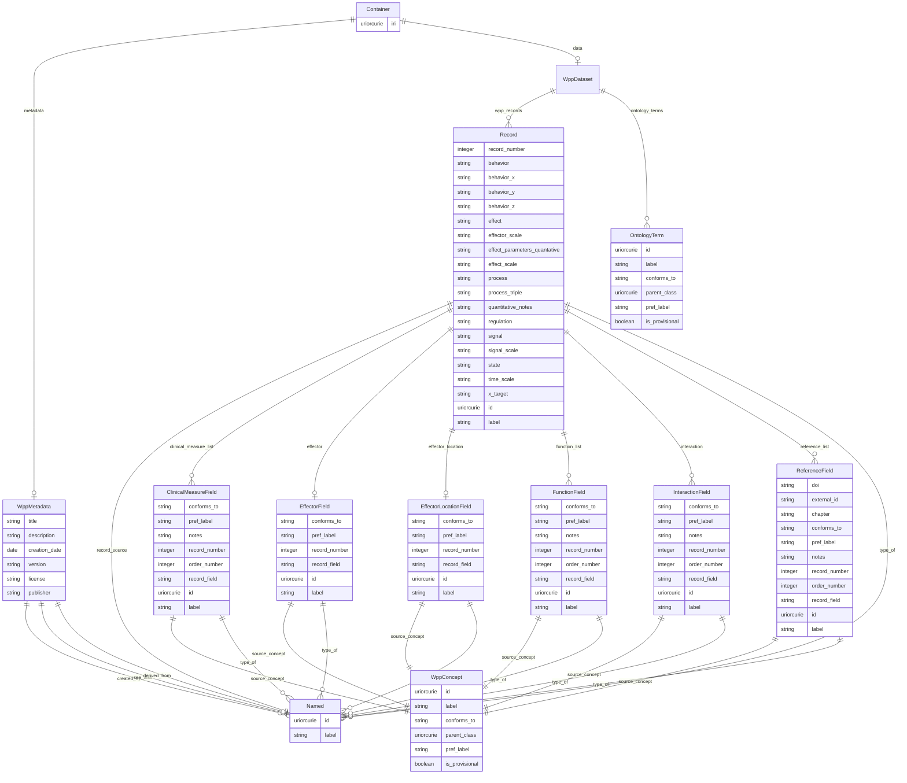
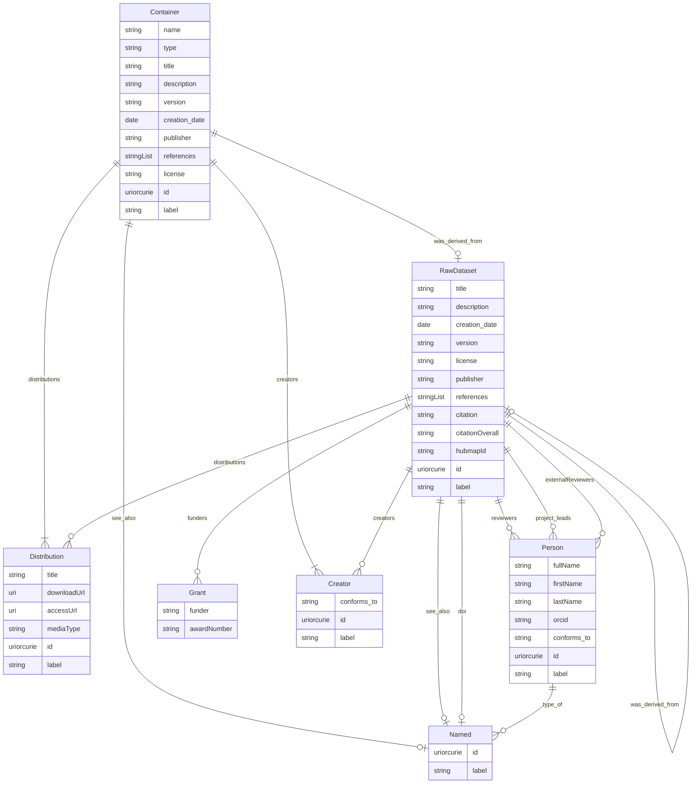

# HRA DO Processor Diagrams
## wpp

```mermaid
erDiagram
Container {
    uriorcurie iri  
}
WppDataset {

}
OntologyTerm {
    uriorcurie id  
    string label  
    string conforms_to  
    uriorcurie parent_class  
    string pref_label  
    boolean is_provisional  
}
Record {
    integer record_number  
    string behavior  
    string behavior_x  
    string behavior_y  
    string behavior_z  
    string effect  
    string effector_scale  
    string effect_parameters_quantative  
    string effect_scale  
    string process  
    string process_triple  
    string quantitative_notes  
    string regulation  
    string signal  
    string signal_scale  
    string state  
    string time_scale  
    string x_target  
    uriorcurie id  
    string label  
}
Named {
    uriorcurie id  
    string label  
}
ReferenceField {
    string doi  
    string external_id  
    string chapter  
    string conforms_to  
    string pref_label  
    string notes  
    integer record_number  
    integer order_number  
    string record_field  
    uriorcurie id  
    string label  
}
WppConcept {
    uriorcurie id  
    string label  
    string conforms_to  
    uriorcurie parent_class  
    string pref_label  
    boolean is_provisional  
}
InteractionField {
    string conforms_to  
    string pref_label  
    string notes  
    integer record_number  
    integer order_number  
    string record_field  
    uriorcurie id  
    string label  
}
FunctionField {
    string conforms_to  
    string pref_label  
    string notes  
    integer record_number  
    integer order_number  
    string record_field  
    uriorcurie id  
    string label  
}
EffectorLocationField {
    string conforms_to  
    string pref_label  
    integer record_number  
    string record_field  
    uriorcurie id  
    string label  
}
EffectorField {
    string conforms_to  
    string pref_label  
    integer record_number  
    string record_field  
    uriorcurie id  
    string label  
}
ClinicalMeasureField {
    string conforms_to  
    string pref_label  
    string notes  
    integer record_number  
    integer order_number  
    string record_field  
    uriorcurie id  
    string label  
}
WppMetadata {
    string title  
    string description  
    date creation_date  
    string version  
    string license  
    string publisher  
}

Container ||--|o WppMetadata : "metadata"
Container ||--|o WppDataset : "data"
WppDataset ||--}o Record : "wpp_records"
WppDataset ||--}o OntologyTerm : "ontology_terms"
Record ||--|| Named : "record_source"
Record ||--}o ClinicalMeasureField : "clinical_measure_list"
Record ||--|o EffectorField : "effector"
Record ||--|o EffectorLocationField : "effector_location"
Record ||--}o FunctionField : "function_list"
Record ||--}o InteractionField : "interaction"
Record ||--}o ReferenceField : "reference_list"
Record ||--}o Named : "type_of"
ReferenceField ||--|| WppConcept : "source_concept"
ReferenceField ||--}o Named : "type_of"
InteractionField ||--|| WppConcept : "source_concept"
InteractionField ||--}o Named : "type_of"
FunctionField ||--|| WppConcept : "source_concept"
FunctionField ||--}o Named : "type_of"
EffectorLocationField ||--|| WppConcept : "source_concept"
EffectorLocationField ||--}o Named : "type_of"
EffectorField ||--|| WppConcept : "source_concept"
EffectorField ||--}o Named : "type_of"
ClinicalMeasureField ||--|| WppConcept : "source_concept"
ClinicalMeasureField ||--}o Named : "type_of"
WppMetadata ||--}o Named : "created_by"
WppMetadata ||--|o Named : "see_also"
WppMetadata ||--|o Named : "derived_from"

```

## basic-metadata

```mermaid
erDiagram
Container {
    string name  
    string type  
    string title  
    string description  
    string version  
    date creation_date  
    string publisher  
    stringList references  
    string license  
    uriorcurie id  
    string label  
}
RawDataset {
    string title  
    string description  
    date creation_date  
    string version  
    string license  
    string publisher  
    stringList references  
    string citation  
    string citationOverall  
    string hubmapId  
    uriorcurie id  
    string label  
}
Distribution {
    string title  
    uri downloadUrl  
    uri accessUrl  
    string mediaType  
    uriorcurie id  
    string label  
}
Person {
    string fullName  
    string firstName  
    string lastName  
    string orcid  
    string conforms_to  
    uriorcurie id  
    string label  
}
Named {
    uriorcurie id  
    string label  
}
Grant {
    string funder  
    string awardNumber  
}
Creator {
    string conforms_to  
    uriorcurie id  
    string label  
}

Container ||--}| Creator : "creators"
Container ||--|o Named : "see_also"
Container ||--}| Distribution : "distributions"
Container ||--|o RawDataset : "was_derived_from"
RawDataset ||--}o Creator : "creators"
RawDataset ||--}o Person : "reviewers"
RawDataset ||--|o Named : "see_also"
RawDataset ||--}o Grant : "funders"
RawDataset ||--|o Named : "doi"
RawDataset ||--}o Person : "project_leads"
RawDataset ||--}o Person : "externalReviewers"
RawDataset ||--}o Distribution : "distributions"
RawDataset ||--|o RawDataset : "was_derived_from"
Person ||--}o Named : "type_of"

```

