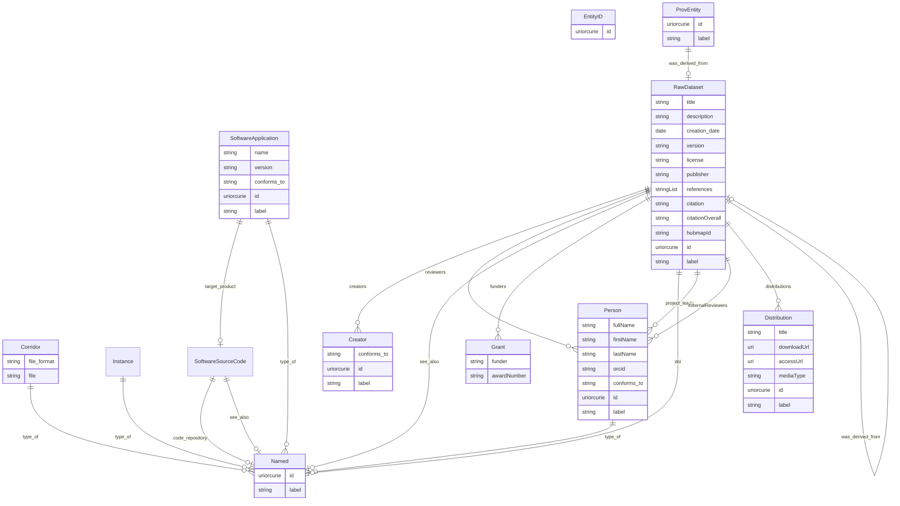
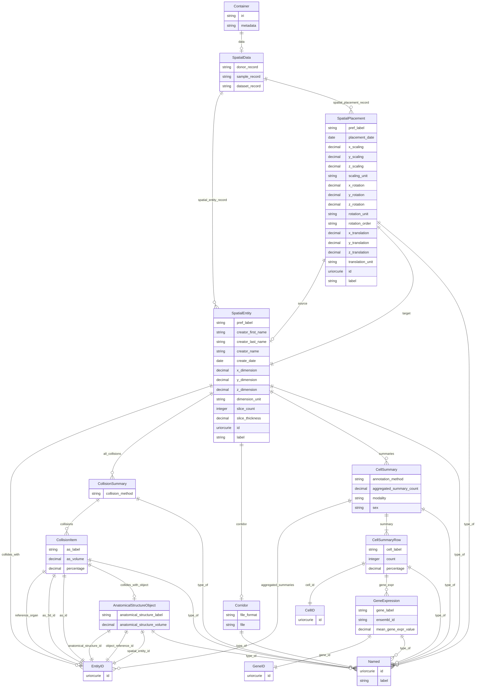
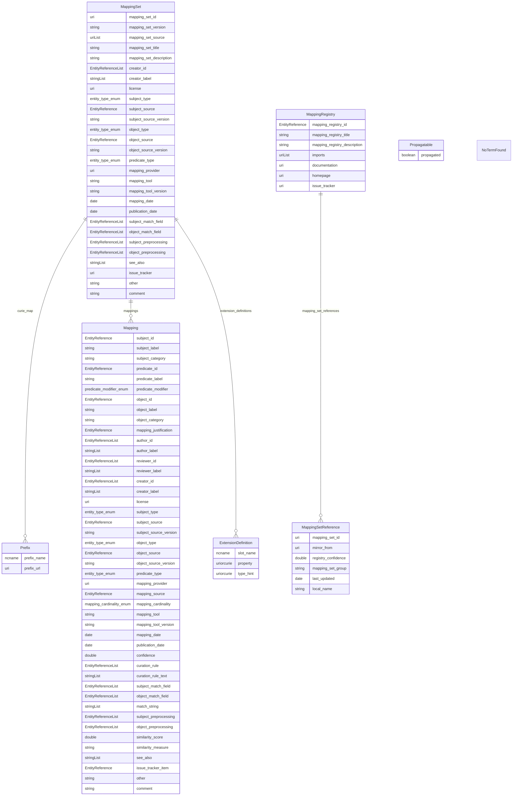

# HRA DO Processor Diagrams
## 2d-ftu

## asct-b

## basic

## cell-summary

## collection

## collision

## corridor

## ctann

## dataset

## donor

## ds-graph

## graph

## landmark

## omap

## ref-organ

## sample

## spatial

## sssom

## vocab

## basic-metadata

